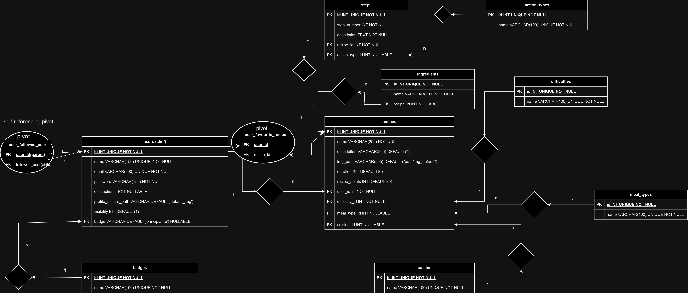

MyHomeChef Project

Creato con Laravel/Inertia.js/Vue3

***Per accedere all'app bisogna essere registrati obbligatoriamente***  
Idea:  
    
- Un app che permette allo USER (lo CHEF utente registrato) di pubblicare RECIPES (ricette) pubbliche o private, nella sua chef_page. Le RECIPE avranno un nome, un livello di DIFFICULTY, la durata per eseguirle, la lista di INGREDIENTS necessari e i recipe_points (punteggio della ricetta)  
  
- Gli USER (utenti registrati) possono seguire altri USER e mettere + alle loro ricette pubbliche che aumenteranno i loro recipe_points complessivi (somma di tutti i recipe_points di ogni ricetta). Gli CHEF che premono + su una RECIPE la inseriscono nella pagina suggested_recipes_page di ogni USER  
  
- Gli USER hanno i Badge (gradi: Principiante, Appassionato, Aiuto Cuoco, chef, Chef Stellato, Nonna) in base al totale dei recipe_points  
  
- le RECIPES hanno un MEAL_TYPE opzionale (tipo di pietanza: primo, secondo, dessert, antipasto ecc) e hanno la CUISINE opzionale (tipo di cucina: esotica, italiana, cinese, giapponese, americana, balcana, creativa ecc)  
  
- ogni RECIPE ha il Nome, Descrizione, Tempo, DIFFICULTY, i Recipe_points(punteggio della ricetta, ogni volta che viene messo un +), gli INGREDIENTS (ingredienti della ricetta), gli STEPS (passaggi) con ordine modificabile, la Visibilità  
  
- ci sarà una lista di DIFFICULTY da poter assegnare alla RECIPE  
  
- Ogni STEP ha il suo Step_number(per ordinarli), una ACTION_TYPE opzionale(azioni: cuoci, taglia, mescola, raffredda, congela ecc) e la descrizione dello STEP  
  
- Gli INGREDIENTS (ingredienti della ricetta) che hanno il nome e appartengono a una CATEGORY opzionale (categoria di ingrediente: carne, verdura, pesce, panificati, bevanda, spezia, frutta ecc) nella recipe_page ce la sezione timeline(scaletta) composta da STEPS(passaggi con ordine modificabile) a cui potranno essere associate una o piu ACTION_TYPE (azioni: cuoci, taglia, mescola, raffredda, congela ecc) con la descrizione di cosa fare   
  
- ci sarà una home_page dove verranno mostrate in ordine cronologico le RECIPE che ogni USER seguito pubblica assieme alle nostre.  
- se uno USER non segue ancora nessuno nella home_page verranno suggeriti 5 USER o RECEIPTS random in modo da avviare il motore del follow  
  
  
***DATABASE***

